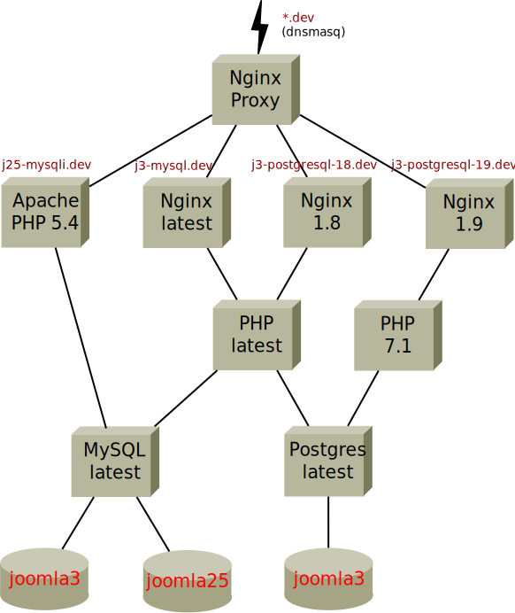

# Joomla! Virtualisation

The Joomla! Virtualisation tool generates a `docker-compose.yml` file based on XML setup definitions used for - but not limited to - automated testing. 
It is based on [GreenCape/build](https://github.com/GreenCape/build).

*This repository also contains a set of* `Dockerfile`*s. Once they no longer undergo frequent changes, the images will be available on DockerHub.*

## Installation

*Joomla! Virtualisation is work in progress. Once it has everything to really be usable, it will be available for installation through Composer.*

> Be sure to use recent versions of `docker` and `docker-compose`. The versions you get from the standard repository for Ubuntu 16.04, for example, are too outdated.
Follow the official instructions for [Docker Community Edition (CE)](https://docs.docker.com/engine/installation/) and [Docker Compose](https://docs.docker.com/compose/install/) to get the most recent versions.
  
## Usage

```php
use Joomla\Virtualisation\DockerComposeGenerator;

$generator = new DockerComposeGenerator('tests/servers');
$generator->write('dockyard/docker-compose.yml');
```

where '`tests/servers`' is the directory containing the XML setup configurations and '`dockyard`' is the docker build directory defined in the environment (see Environment / `host` / `dockyard` in the next section).

### Define Test Environments

Create a new directory `servers` under your `tests` directory. It will house the following XML files to describe server configurations.

#### Databases

The database credentials are expected to be in a file named `database.xml` in the `tests/servers` directory.

```xml
<database>
    <mysql version="latest" name="joomla_test" user="sqladmin" password="sqladmin" rootPassword="root"/>
    <postgresql version="latest" name="joomla_test" user="sqladmin" password="sqladmin"/>
</database>
```

##### MySQL

Defines version and credentials for a MySQL (compatible) database server.

- `version` - The version of MySQL to use. Supported are all minor versions since MySQL 5.5. Defaults to 'latest'.
- `name` - The name of the database.
- `user` - The name of the database user.
- `password` - The database user’s password.
- `rootPassword` - The database root password.

##### PostgreSQL

Defines version and credentials for a PostgreSQL database server.

- `version` - The version of PostgreSQL to use. Supported are all minor versions since PostgreSQL 9.2. Defaults to 'latest'.
- `name` - The name of the database.
- `user` - The name of the database user.
- `password` - The database user’s password.

#### Environment

```xml
<environment name="env-name">
    <host dockyard="shipyard"/>
    <joomla version="3" sampleData="data"/>
    <database driver="mysql" name="joomla3" prefix="j3m_"/>
    <server type="nginx" offset="UTC" tld="dev"/>
    <php version="5.4"/>
    <cache enabled="0" time="15" handler="file"/>
    <debug system="1" language="1"/>
    <meta description="Test installation" keywords="" showVersion="0" showTitle="1" showAuthor="1"/>
    <sef enabled="0" rewrite="0" suffix="0" unicode="0"/>
    <feeds limit="10" email="author"/>
    <session lifetime="15" handler="database"/>
</environment>
```

- `name` - The name for this environment. For the default environment, it is always `default`.

Common settings to all test servers are kept in an environment named `default` and stored in `default.xml`.
An average environment definition will contain just the server, joomla, and database elements.

##### `host`

Defines settings of the docker host.

- `dockyard` - This setting determines the directory, where the the generated volumes (file systems) are located.

##### `joomla`

Defines the Joomla version and the sample data.

- `version` - This setting determines the Joomla version to be installed in this environment. It can be any Joomla version since 1.0.0. The version can be fully qualified, e.g., 3.4.2, but 3.4, 3, latest, master, or staging can also be used.
- `sampleData` - Which sample data to install, if any. The file `sample_<value>.sql` must exist for the selected Joomla version and database driver.

##### `database`

The hostname of the database server is determined by the selected driver. The corresponding container is automatically linked to the Joomla installation.

- `driver` - This determines the type of the database being used by this Joomla installation. Currently, mysql, mysqli, pdomysql, and postgresql are supported.
- `name` - The name of the database containing the Joomla site’s data tables.
- `prefix` - The prefix applied to the name of the database tables used by this Joomla installation. For Joomla v1.5.x and v1.6.x this is “jos” by default, and should another Joomla site have to share the same database, the database tables would be kept separate by setting up this second site with a different prefix – e.g. “jos2”. With Joomla v1.7.x the same result is achieved by using a prefix that is a randomly generated alphabetic code and underscore – e.g. “vduea_”.

##### `server`

Define the server settings.

- `type` - The engine to use. Valid values are nginx and apache.
- `offset` - The time zone.
- `tld` - The top level domain for the URL.

##### `php`

Define the PHP version.

- `version` - The PHP version to use. Supported are all minor versions since PHP 5.4. Defaults to 'latest'.

##### `cache`

Defines the Joomla! cache settings. These values are written to the `configuration.php` file.

- `enabled` - This setting controls whether or not site caching is enabled. When enabled, web pages are held for a period of time in cache storage and are retrieved from there rather than being re-created each time required.
- `handler` - This setting defines the mechanism used to manage the cache storage.
- `time` - This parameter defines the maximum time for which web pages are held in the cache storage before being updated with the current version. The default is 15 minutes.

##### `debug`

Defines the Joomla! debug settings. These values are written to the `configuration.php` file.

- `system` - If set to “1”, Joomla will add debug information on every page, below the normal web page area. This information will include various forms of diagnostic information, including the full database queries used in generating the page. The default setting is “No”. The mix and format of diagnostic information presented by the debug function may be altered by editing the parameters of the Debug - System plug-in (Extensions > Plug-in Manager).
- `language` - If set to “1”, Joomla will activate features designed to help debug language translations for a Joomla site. This includes the addition of language translation information to page debug information (requires system also set to “1”), and markers to show translated content within the web pages themselves. For further information, refer to Debugging a translation.

##### `meta`

Defines the Joomla! meta settings. These values are written to the `configuration.php` file.

- `description` - Text added here appears in web page headers as the “description” metadata entry.
- `keywords` - Words and phrases (separated by commas) added here appear in web page headers as the “keywords” metadata entry.
- `showVersion` - Whether or not to expose the Joomla version in the metadata.
- `showTitle` - (Only present in Joomla v1.6.x and later.) Appends the site name to page titles in the `title` tag of each web page header. Joomla v1.6.x introduced this feature as an option to either include the site name text before the page title (e.g. Site Name – Page Name) or omit it. With Joomla v1.7.x the options also include inserting the site name after the page name (e.g. Page Name – Site Name) as well as before.
- `showAuthor` - When this parameter is set to “1” an “author” metadata entry is added to the page header when appropriate, using the content item’s author name as the metadata text.

##### `sef`

Defines the Joomla! SEF settings. These values are written to the `configuration.php` file.

- `enabled` - Joomla’s internal representation of URLs tends to be lengthy and also difficult to interpret by humans and search engine spiders. This is a typical example of the internal URL for a page displaying a content item: www.example.com/index.php?option=com_content&view=article&id=22&Itemid=437. If this option is set to “1”, the URL is modified into a shorter and more meaningful form: www.example.com/index.php/getting-started. The identifying text in the URL (in this case “getting_started”) is derived from the Alias text set up for each Category, content item, and Menu item.
- `rewrite` - When this parameter is set to “1”, Joomla will use the mod_rewrite function of Apache web servers to eliminate the `index.php` part of the URL. Thus when this is operating the “search engine friendly” URL shown above will become: www.example.com/getting-started.

   *Note: This parameter is set to “0” by default. It should not be set to “1” unless the web server uses Apache software. The `htaccess.txt` file is automatically renamed to `.htaccess`.*

- `suffix` - When set to “1”, Joomla will add .html to the end of the most site URLs thus simulating static file-based web content. The URLs shown above will then become: www.example.com/index.php/getting-started.html or www.example.com/getting-started.html.
- `unicode` - (Only present in Joomla v1.6.x and later.) When saving edited content, the former setting attempts to convert, where appropriate, any alias text into the corresponding Latin characters. When set to “1”, Joomla leaves any non-Latin characters in the alias text unchanged. Changing this parameter does not retroactively change aliases, it just changes the behaviour of automatic alias generation for future content editing and creation.

##### `feeds`

Defines the Joomla! feeds settings. These values are written to the `configuration.php` file.

- `limit` - The number of content items to be shown in any RSS newsfeeds set up on the web site. By default, this is set to 10, although unless the site is very active a smaller number may be better.
- `email` - Atom and RSS newsfeeds generated from site content by the Joomla “Syndicate feeds” (“Syndication” in Joomla v1.5.x) site module may include an e-mail address as part of the author’s identity. This parameter determines the source of that email address: the “author” setting will use the email address held on the site for content author, “site” will use the “From email” address set up under the Server tab for emails generated automatically by the web site.

##### `session`

Defines the Joomla! session settings. These values are written to the `configuration.php` file.

- `lifetime` - This parameter determines how long a before user is automatically logged off for being inactive. The default setting is 15 minutes, although it can be useful to temporarily lengthen this parameter on development sites to avoid having to repeatedly log back in.
- `handler` - Selects the mechanism used to hold session information between one page request and the next one from the same user. The options are “database” (the default) and “none”. The former stores session information as entries in a table in the site’s Joomla database, the latter uses the session handling mechanism built in to PHP.

#### Examples

Latest Joomla!2.5 on Apache with MySQLi and sample data

```xml
<environment name="j25-mysqli">
    <joomla version="2.5" sampleData="data"/>
    <server type="apache"/>
    <database driver="mysqli" name="joomla25" prefix="j2m_"/>
</environment>
```

Latest Joomla!3 on Nginx with PostgreSQL, no sample data

```xml
<environment name="j3-postgresql">
    <joomla version="3"/>
    <server type="nginx"/>
    <database driver="postgresql" prefix="j3p_"/>
</environment>
```

## Contribute

PRs are welcome.
If you encounter any bug or issues, please use the [issue tracker](https://github.com/joomla-projects/virtualisation/issues).

To contribute code or bugfixes, clone this repository, add your changes and make a pull request against the `develop` branch.

### Running Tests

On the command line, enter

    $ phpunit

within the project's root directory.

The main test creates a complete setup in the `dockyard` directory, which can be used
to explore the possibilities. To invoke it, run

    $ phpunit tests/DockerComposeGeneratorTest
    
This step is already included in the convenience command `composer build` as described below.

#### Container Tests

For the Apache and PHP-FPM containers, this project provides own images (see `src/Service/docker`). To ensure that those
images have the required traits, a separate suite of tests was created in `tests-container`. They were separated
from the other tests, because they need 1-2 minutes for each container and PHP version to run.

The tests ensure that for each supported PHP version

- Containers build successfully and
- both FPM resp. Apache handler and CLI
  - have the requested PHP version
  - have a suitable Xdebug version enabled
  - use catchmail instead of sendmail
  - support OpenSSL
  - support MysqlI and PDO Driver for MySQL
  - support PostgreSQL and PDO Driver for PostgreSQL

To run these tests, enter

    $ phpunit tests-container

on the command line.

### Convenience Commands

Some `composer` scripts are provided to make life a bit easier. They are run from the project's root directory, and frees you from having to change into the `dockyard` directory as required by `docker-compose`.

#### Run the Tests in Clean Environment

    $ composer test
    
PHPUnit is run with the `--testdox` option after removing `dockyard` content.

#### Setup the Virtual Network

    $ composer build
    
Runs the main test and builds all docker images. This network is created:


#### Start the Virtual Network

    $composer start
    
Starts the containers in the background after running the tests.

#### Stop the Virtual Network

    $ composer stop
    
Stops all running containers.

#### Tear Down the Virtual Network

    $ composer clean
    
Removes the containers and the `dockyard` content. If necessary, the containers are stopped automatically.
